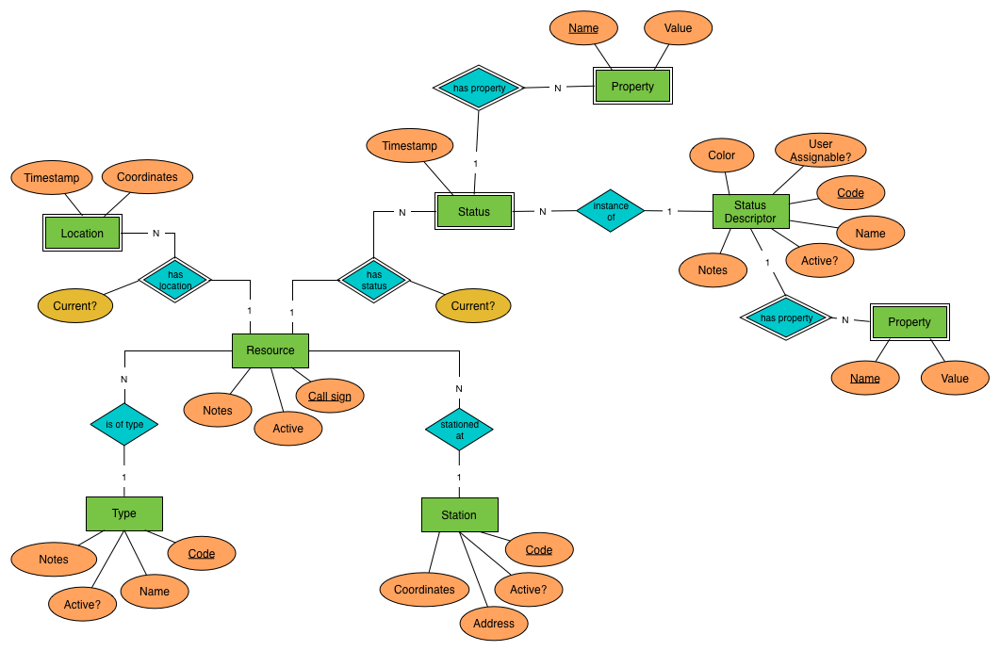

# Resources Module

The **resources module** is responsible for keeping track of different resources, their capabilities, location and status.

## Entity Model

The following E-R diagram summarizes the most important entities, their attributes and relations. The actual names used in the implementation may differ.

*Soft deletes* are used for all entities in the system, meaning that no data is ever actually deleted from the database. An *active* flag is used to filter out entities that have been marked as deleted. All changes made to an entity after it has been created are logged. Weak entities cannot be modified after they have been created.

### Entities

* *Resource*: anything that can be dispatched to an incident, such as an ambulance, a fire truck or an incident commander. A resource is uniquely identified by its radio call sign across all the modules of the system and so it can't be changed (if it must change, a new resource should be created instead).
* *Type*: different resources are used for different things. A type is used to classify resources according to their capabilities so that the correct type of resources can be dispatched to an incident. In a real system, the capabilities would have to be more finegrained than this but in our case this is good enough. A type is uniquely identified by its code across all the modules of the system and so it can't be changed once assigned.
* *Station*: a fixed location (normally a fire station) where a resource is 
stationed (quartered) when not responding to calls. A station is uniquely identified by its code acress all the modules of the system and so it can't be changed once assigned.
* *Status Descriptor*: at any given time, an active resource has a status. Status descriptors are used to define which statuses a resource can be in. Some statuses can be reported by the resource itself (e.g. the driver pressing a button on a panel on the dashboard) whereas other statuses can only be set by the system (e.g. as a result of a command). A status descriptor is uniquely identified by its code across all the modules of the system and so it can't be changed once assigned.

### Weak Entities

* *Location*: the geographical location of a resource. This can be reported either by the resource itself (e.g. GPS tracking) or set as a result of a command (e.g. when the status changes to 'AT STATION', the location becomes the location of the station). The latest location is the current location and the one the other modules are most likely interested in, though it is possible to query past locations as well.
* *Status*: the status of a resource. This can be reported either by the resource itself or set as a result of a command. The latest status is the current one and the one the other modules are most likely intersted in, though it is possible to query past statuses as well.
* *Property*: a key-value pair that is used to attach additional information to statuses and status descriptors. This information may be used to drive processes in other modules.

## MQ Interface

The primary means of interacting with the Resources module is through an MQ.

### Command Queues

Commands alter the state of the system. A command queue does not require a reply address. If a reply address is present, the outcome of the command will be sent (at least a status code, possibly also additional information). If no reply address is present, the command will still be performed but the outcome will not be sent anywhere ("fire and forget").

* `/resources/cmd/set-status`: changes the status of a resource.
* `/resources/cmd/set-location`: changes the location of a resource.
* TODO CRUD operations

### Query Queues

Queries are only used to query the system for information and do not alter the system state. A query queue requires a reply address where the query result will be sent. Incoming requests without a reply address will be ignored.

* TODO Define query queues

### Event Topics

Event topics are used to inform other modules of events that happen in the Resources module. Any module can subscribe to any topic.

* `/resources/evt/status-changed`: whenever the status of a resource is changed.
* `/resources/evt/location-changed`: whenever the location of a resource is changed.
* `/resources/evt/resource-modified`: whenever a resource is created, updated or "deleted".
* `/resources/evt/station-modified`: whenever a station is created, updated or 'deleted'.
* `/resources/evt/status-descriptor-modified`: whenever a status descriptor is created, updated or "deleted".
* `/resources/evt/type-modified`: whenever a resource type is created, updated or "deleted".

## Persistence

ToDo

## Security

ToDo
